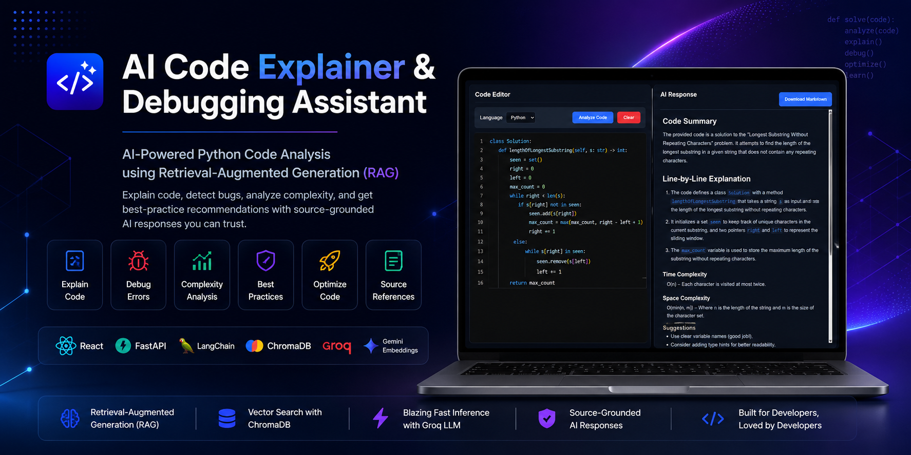

  

<h1 align="center">AI Code Explainer & Debugging Assistant</h1>

  <strong>An AI-powered developer tool that explains Python code, detects bugs, analyzes complexity, and provides best-practice recommendations using a Retrieval-Augmented Generation (RAG) pipeline.</strong>

  <a href="https://aicodeanalyzerdemo.netlify.app/"><strong>🌐 Live Demo</strong></a> •
  <a href="https://ai-code-explainer-backend-g48q.onrender.com/docs"><strong>⚡ API Docs</strong></a> •
  <a href="https://github.com/LaxmanRoy14/AI-Code-Explainer"><strong>📂 Repository</strong></a>

---

## Overview

The **AI Code Explainer & Debugging Assistant** is a full-stack Generative AI application designed to help developers understand, debug, and improve Python code through intelligent, context-aware analysis.

Unlike traditional AI chatbots, this project uses a **Retrieval-Augmented Generation (RAG)** architecture. Before generating a response, the application retrieves relevant programming knowledge from a curated documentation base using **LangChain**, **Gemini Embeddings**, and **ChromaDB**, then combines that context with a **Groq LLM** to produce grounded, accurate, and structured explanations.

Users can paste Python code into a Monaco-powered editor and receive:

-  Code explanations
-  Line-by-line analysis
-  Syntax, runtime, and logical error detection
-  Time & space complexity analysis
-  Best-practice recommendations
-  Optimized code suggestions
-  Source-grounded AI responses
-  Downloadable Markdown reports

This project demonstrates the integration of modern AI technologies with a production-ready full-stack architecture, making it an excellent showcase of **RAG**, **vector databases**, **LLM orchestration**, and **modern web development**.
# AI Code Explainer & Debugging Assistant

> An AI-powered developer tool that explains Python code, detects bugs, analyzes complexity, and provides best-practice recommendations using a Retrieval-Augmented Generation (RAG) pipeline.

 <strong>Live Demo:</strong> https://aicodeanalyzerdemo.netlify.app/

 <strong>Backend API:</strong> https://ai-code-explainer-backend-g48q.onrender.com

 <strong>GitHub Repository:</strong> https://github.com/LaxmanRoy14/AI-Code-Explainer

---

## Overview

The **AI Code Explainer & Debugging Assistant** is a full-stack Generative AI application designed to help developers understand, debug, and improve Python code through intelligent, context-aware analysis.

Unlike traditional AI chatbots, this project uses a **Retrieval-Augmented Generation (RAG)** architecture. Before generating a response, the application retrieves relevant programming knowledge from a curated documentation base using **LangChain**, **Gemini Embeddings**, and **ChromaDB**, then combines that context with a **Groq LLM** to produce grounded, accurate, and structured explanations.

Users can paste Python code into a Monaco-powered editor and receive:

- Code explanations
- Syntax, runtime, and logical error detection
- Time and space complexity analysis
- Best-practice recommendations
- Optimized code suggestions
- Source references used to generate the response

The project demonstrates the integration of modern AI technologies with a production-ready full-stack architecture, making it suitable as both a practical developer tool and a portfolio project showcasing Retrieval-Augmented Generation (RAG), vector databases, LLM orchestration, and modern web development.